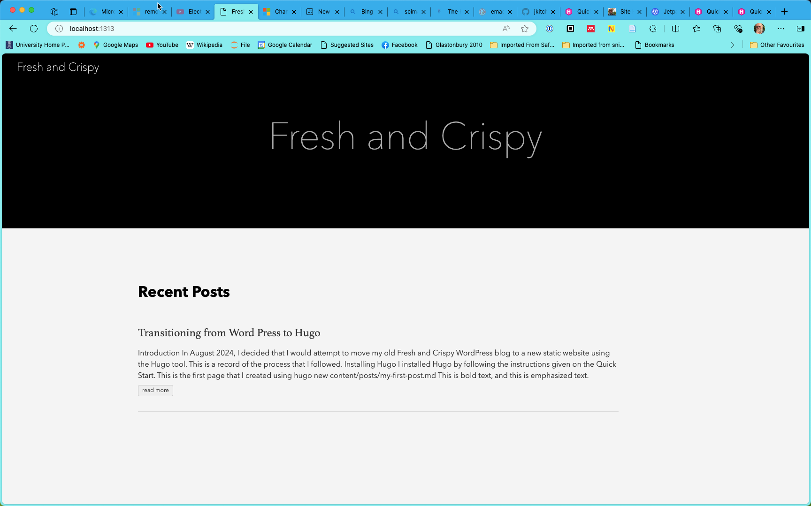

+++
title = 'Transitioning from Word Press to Hugo'
date = 2024-08-08T18:21:12+01:00
draft = false
tags = ['blog','hugo']
+++

## Introduction

In August 2024, I decided that I would attempt to move my old *Fresh and Crispy* WordPress blog to a new static website using the [Hugo](https://gohugo.io) tool. This is a record of the process that I followed.

## Installing Hugo

I installed Hugo by following the instructions given on the [Quick Start](https://gohugo.io/getting-started/quick-start/).

This is the first page that I created using

```
hugo new content/posts/my-first-post.md
```

This is what the new blog site looks like after this first step



## Export WordPress Site

I logged into my WordPress site for the first time since November 2020 and posted a quick post about my [plans to transition to hugo](https://blog.cpjobling.net/uncategorized/thinking-of-transitioning-to-hugo/).

I went to the dashboard and exported my old blog to an XML file.

## Import to Hugo

There are a number of ways to migrate content from other sources to Hugo which you can follow up by reading [Migrate to Hugo](https://gohugo.io/tools/migrations/).

There seem to be two options available:

- [blog2md](https://github.com/palaniraja/blog2md) - Blog to Markdown
- [wp2hugo](https://github.com/ashishb/wp2hugo) - WordPress to Hugo

After a quick read of the documentation for both tools, it seemed that `wp2hugo` would be good for the first attempt.

### Building `wp2hugo`

I decided to build `wp2hugo` from source:

```
$ git clone git@github.com:ashishb/wp2hugo.git
$ cd wp2hugo/src/wp2hugo
$ make build_prod
# `./bin/wp2hugo` will contain the binary and you can use it as `$ ./bin/wp2hugo --source wordpress-export.xml --download-media`
```

I ran the application as
```
~/bin/wp2hugo --source wpblog.xml --download-media
```
but there were errors downloading the media which caused the program to bail. So, I tried 
`~/bin/wp2hugo --source wpblog.xml`
instead. 

I got the text of my posts out of WP this way, but would need to manually go through my posts on WP to rescue what images I could.

Tomorrow, I will try `blog2md` to see if that's more error-tolerant.

### Building `blog2md`

This is a node application. This is how I built it:
```
mkdir ~/code/src/github.com/palaniraja
cd $_
git clone https://github.com/palaniraja/blog2md.git
cd blog2md
npm install
npm audit fix --force # Needed to correct some warnings
```

### Converting blog using `blog2md`

This seemed to work well! From the directory were I built `blog2md`, I ran:
```
node index.js w ~/Downloads/delete_me/freshandcrispy.WordPress.2024-08-08.xml out m paragraph-fix
```
and it seemed to work without issues!
```
$ ls out | wc
569     569   17725
```
### Viewing the new blog

After conversion, all the markdown files appear in a flat directory. Each markdown file has
meta data like:
```
---
title: 'Welcome to my new home'
date: Fri, 11 Feb 2011 21:21:23 +0000
draft: false
tags: ['Uncategorised']
---

```

These files just needed to be copied over to `content/posts` in the Hugo site and served using
```
hugo server -D
```

On visiting the served site, there was one YAML error that I quickly corrected.

There were a number of files, e.g. social media links, that need to be taken out of the posts content. And I'll need to go through WordPress to reclaim images, etc.

I will start to tidy up tomorrow!

In the meantime, I checked the new content into version control!!

## Some tuning

I arranged the posts into folders by year. This was a largely manual process in which I first identified the posts using grep:
```
grep -l "2024 " *.md > mv2024
```

I then edited the file `mv2024` to prepend `mv ` to each line and add ` 2024`. The result is a file
```
mkdir 2024
mv .... 2024
mv .... 2024
:
```

This can then be excuted using 
```
sh mv2004
```

I am sure that this could be done more cleverly, but it was a one time operation.

## Setting up `.gitignore`

The public folder is regenerated whenever the site is previewed and you get a lot of false versions if `public` is commited to version control. I edited `.gitignore` to ignore `public`.
